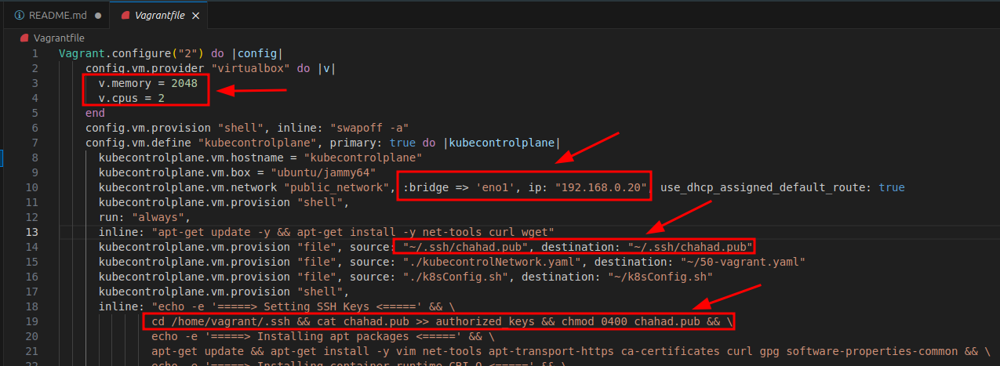
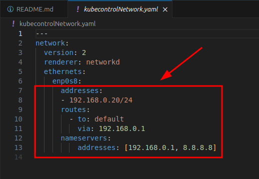
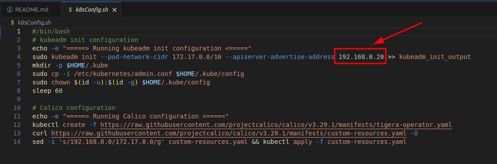
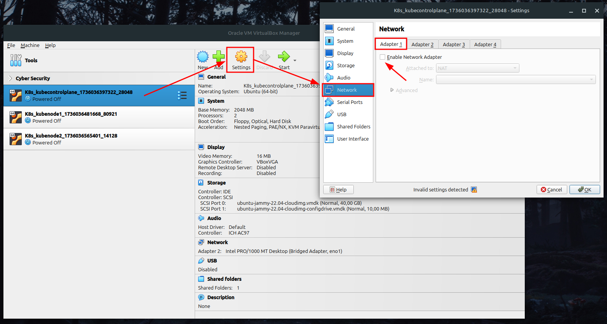
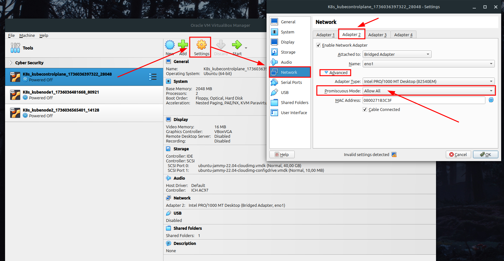
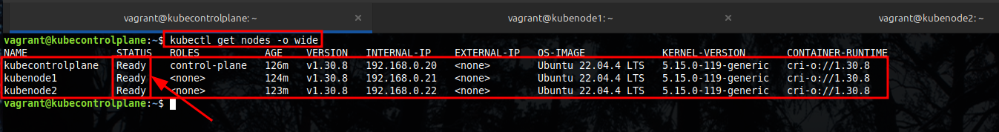
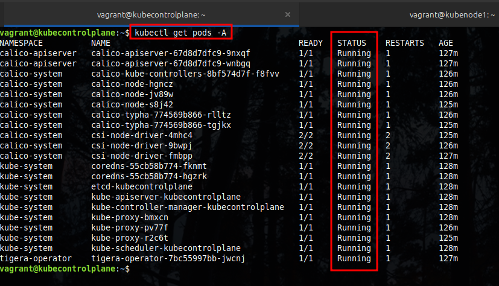

# Dedicated Project to install Kubernetes (v1.30) using Vagrant and VirtualBox
## Create by Chahad Tecnologia - version 1.0.0

# Introduction
The purpose of this project is to configure a laboratory of Kubernetes to help anyone to understand or study more about the solution. I do not provide explanations here about the components used by Kubernetes, but only the process of configuring the environment for the lab. My recommendation is that you first understand how Kubernetes works and only then use this project as a lab.

All configuration process was created using the official Kubernetes documentation. Please, for more information about the official documentation of Kubernetes [click here.](https://kubernetes.io/docs/setup/production-environment/tools/kubeadm/install-kubeadm/)

# Hardware Configuration
For the properly work of the environment, it's important to mention that it will be necessary to have resources such as memory, CPU and disk space available, so make sure you have minimum resources available on your computer or laptop.

The minimum recommendation for this lab is:

- 8GB of memory
- 8 CPU
- 120 GiB of free space on the system.

# Requested Solutions
You will need to have on your machine the Vagrant and Virtualbox solutions. 
The versions used during the development of this project was:

- [Vagrant](https://www.vagrantup.com/) = Version 2.4.3
- [VirtualBox](https://www.virtualbox.org/) = Version 7.0.20 r163906

**Obs.:** The operating system used for create this environment was [Linux Mint](https://linuxmint.com/) 22 Cinnamon, version 6.2.9.

# Kubernetes Environment 
For this laboratory three virtual machines will be created. One will be the Kubernetes Control Plane and the another two will be the nodes, used to maintain the applications.

The hostnames and IP addresses used for each machine are:

- kubecontrolplane = 192.168.0.20/24
- kubenode1 = 192.168.0.21/24
- kubenode2 = 192.168.0.22/24

To configure a Kubernetes environment in your computer will be necessary change some information on the files, related to the network, network interfaces and SSH key. 

### Network
In my case,the network range was 192.168.0.0/24, used in my local network (router). The configuration of all virtual machines on VirtualBox wil use the **bridged** mode, that permit all machines recieve IP address on the same local network (home network), giving to you access by SSH using the terminal from your computer. Therefore, it will be important that you adjust the files to the network addressing used on your local network.

### Network Interface
Another important change will be related to your network interface, used by your local computer to receive the IP address of your private network, possibly offered by your router using DHCP. In my case, the name of the network interface used was "**eno1**". So, make sure that the name of the network interface is also adjusted in the configuration files.

### SSH Key
Last but not least, your SSH key. Make sure you have an SSH key configured for your Linux system user so that this key can be used during the setting process of all the virtual machines. This key will allow you to access the virtual machines using the "**vagrant**" user. Therefore, make sure that the name of the SSH key, located in your user's "**/home/.ssh**" directory, is configured appropriately.

# Project Files
To implement this environment, some files were created to assist in the virtual machine configuration steps, with the aim of facilitating this process.

### Vagrantfile
The file called "**Vagrantfile**" will be used by Vagrant, through the "**vagrant up**" command, which allows you to configure the virtual machines based on the settings and steps defined in the file.
So, for everything to work correctly, adjust the file by adding the desired amount of CPU and memory, adjusting the name of the network interface and the IP address of the virtual machine and also the name of the SSH key configured for your Linux user.

### Network Files
The **network files** are used to configure the network address of the virtual machines. This process is necessary to fix the IP addresses, keeping the same address after the system reboots.
For each virtual machine a configuration file will be used, so it is important that you adjust each file with the IP address, gateway address and also DNS addresses.

### K8sConfig File 
The file called "**k8sConfig.sh**" will be used to configure the Control Plane, which are the core services of Kubernetes. In this file, it's important that you adjust the IP address that will be used on your Control Plane server, so that the Kubernetes apiserver works correctly.

# Configuration Process

### Vagrant and VirtualBox
With all the files properly adjusted, the next step will be to create the virtual machines using Vagrant. Access the root directory of the files and run the command below:

> vagrant up

This process may take a few minutes, depending on the amount of hardware available on your computer. At the end of the virtual machine configuration process, all of them will be turned off. This process is necessary to make adjustments to the network interfaces of each machine in VirtualBox. By default, VirtualBox creates a **NAT** type interface and this interface should be disabled, keeping only the **bridged** type network interfaces.

To adjust the interfaces in each virtual machine, access the configuration option in VirtualBox (**Settings**). In the network options, disable "**Adapter 1**" and in "**Adapter 2**" access the advanced mode and change the "**Promiscuous Mode**" option to "**Allow All**".

#### Adapter 1

#### Adapter 2

With the network interfaces in VirtualBox properly adjusted, the virtual machines can be powered on.

### Kubernetes Configuration
To configure Kubernetes, more precisely the Kube Control Plane, access the server using your SSH key, using the command below:

> ssh -i ~/.ssh/chahad vagrant@<KUBE_CONTROL_PLANE_SERVER_IP>

Example

> ssh -i ~/.ssh/chahad vagrant@192.168.0.20

**Obs.:** Just remember that in the example above I am using the IP address used in my network. Adjust the command above with the IP address you defined so that access is possible.

The next step will be to run the configuration file "**k8sConfig.sh**". To run the script use the command below, using the "**vagrant**" user, not "**root**" user:

> bash -x k8sConfig.sh

After the script has finished running, the next step is to add the other two servers to Kubernetes, to be used as nodes to run the pods (applications).

At the end of the script execution process, a file called "**kubeadm_init_output**" will be generated, and you will need to copy the "**kubeadm join**" command into it. Copy the entire command and run it on each virtual machine using **sudo**.

After a few seconds, the two virtual machines, which will be used as nodes to maintain the pods, will be ready for use. To validate if the nodes are ready you can use the command below:

> kubectl get nodes -o wide

Below are examples of the expected result:

#### Kubernetes Nodes

#### Kubernetes Pods

That's it! I hope I have contributed to your learning about Kubernetes.